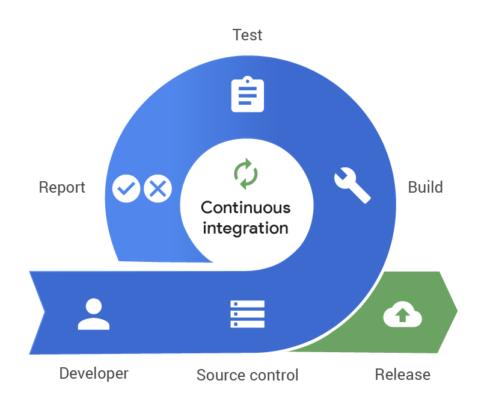
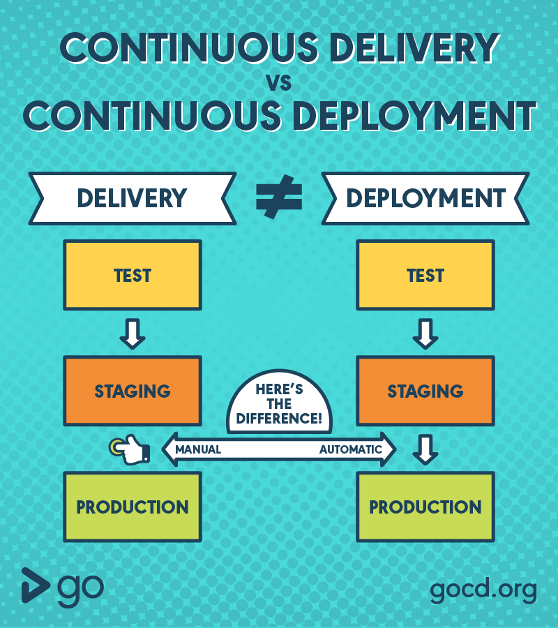

# CI

<<<<<<< HEAD


=======
{width=100px height=100px}
>>>>>>> 77bcfdc75d40af741c549cdb91d1d662d89e6a69
```
CI란 새로운 코드 변경 사항이 정기적으로 빌드 및 테스트 되어
공유 레포지토리에 통합히는 것을 의미 = 지속적인 통합

다수의 개발자가 작업하는 환경이나 MSA환경일경우 필요함


여러명의 개발자가 동시에 같은 코드를 작업할때 충돌을 해결할 수 있음
```

---
<br><br>
# CD

<<<<<<< HEAD

=======

>>>>>>> 77bcfdc75d40af741c549cdb91d1d662d89e6a69

```
CD란 지속적인 서비스 제공 혹은 지속적인 배포 라는 뜻으로    
공유 레포지토리로 자동으로 Release 하는 것
Production 레벨까지 자동으로 deploy 하는 것을 의미한다

->> 개발자의 변경 사항이 레포지토리를 넘어, 고객의 프로덕션(Production) 환경까지 릴리즈 되는 것

개발팀과 비즈니스팀 간의 커뮤니케이션 부족 문제를 해결 할 수 있음
```
