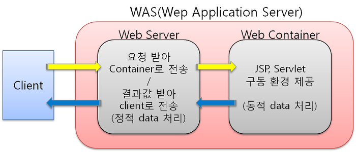

# WEB VS WAS

## WEB 
서버는 정적인 데이터를 처리하는 `웹서버`  
HTTP 규약에 따라 웹 클라이언트와 주고받으며 통신하는 것이 주 역할

## WAS
서버에서 무언가를 처리하고 그 결과를 보여주는 동적인 데이터를 처리하는 웹서버 입니다. 
모가 크고 엔터프라이즈 환경에 필요한 트랜잭션, 보안, 트래픽관리, DB커넥션 풀, 사용자 관리 등의 기능 제공

  

---

## WAS의 단점
  1. 정적,동적 처리 둘다 가능하지만 정적처리를 WAS가 하게되면 부하가 많이 걸려서 좋지 않음

