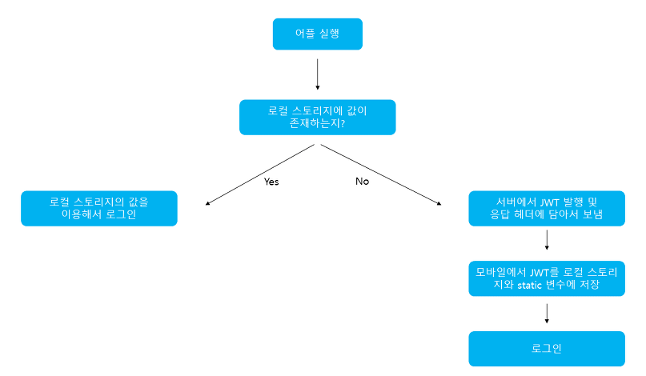
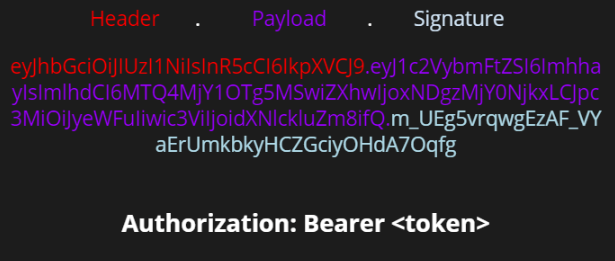

# JWT (JSON WEB TOKEN)

## Jwt 개념
1. Json 포맷을 이용하여 사용자에 대한 속성을 저장하는 Claim 기반의 Web Token이다.
2. Jwt는 토큰 자체로 사용하는 `Self-Contained` 방식으로 정보를 안전하게 전달한다.



jwt를 static변수와 스토리지에 저장한다 -> HTTP 통신때 오버헤드가 발생할수 있기 때문


## 구조

1. JWT는 Header, Payload, Signature 부분으로 이뤄지며 Base64Url로 인코딩됨
2. Base64Url -> 같은 문자열은 항상 같은 문자열로 반환

### Header

헤더는 typ, alg로 이뤄지며 alg는 원하는 알고리즘을 지정하고 typ은 토큰의 타입을 지정함
```
"alg" : "SHA256",
"typ" : JWT
```

### Payload
1. 토큰의 페이로드에는 토큰에서 사용할 정보인 조각들인 `클레임`이 담겨 있다.
2. 클레임은 총 3가지로 나누어지며, Json(Key/Value)형태로 다수의 정보를 넣을 수 있다.

### 등록된 클레임

토큰 정보를 표현하기 위해 이미 정해진 종류의 데이터<br>
 - iss : 토큰 발급자(issuer)
 - sub : 토큰 제목(subject)
 - aud : 토큰 대상자(audience)
 - exp : 토큰 만료 시간(expiration), NumericDate 형식으로 되어 있어야 함
 - nbf : 토큰 활성 날짜(not before), 이 날이 지나기 전의 토큰은 활성화되지 않음
 - iat : 토큰 발급 시간(issued at), 토큰 발급 이후의 경과 시간을 알 수 있음
 - jti : Jwt 토큰 식별자(Jwt Id), 중복 방지를 위해 사용 -> Access token에 사용

### 공개 클레임
- 공개 클레임은 사용자 정의 클레임으로, 공개용 정보를 위해 사용된다.
- 공개 클레임들은 충돌이 방지된 (collision-resistant) 이름을 가져야함
- 충돌 방지를 위해 URI 포맷을 이용함

```
{
    "https://...." : true
}
```

### 비공개 클레임
양 측간에 (보통 클라이언트 <->서버) 협의하에 사용되는 클레임 이름
```
{
    "token_type" : access
}
```

### Signature
- 서명은 토큰을 인코딩하거나 유효성을 검증을 할 때 사용하는 고유한 암호화 코드이다.
- 서명은 위에서 만드는 헤더와 페이로드의 값을 각각 BASE64Url로 인코딩하고, 인코딩한 값을 비밀 키를 이용해 헤더에서 정의한 알고리즘을 해싱을 하고, 이 값을 다시 BASEUrl로 인코딩하여 생성한다.



생성된 토큰은 HTTP 통신을 할 때 Authorization이라는 key의 value로 사용된다. 일반적으로 value에는 Bearer이 앞에 붙여진다.

```
"Authorization" : "Bearer {생성된 토큰 값}",

이렇게 Header에 전달
```
---
## JWT의 장단점
- `Self-contained` 방식이므로 안좋을 수 있다.
- `Payload` 는 인코딩 된것이므로 다시 디코딩될수있다. -> JWE로 암호화 `or` 중요 데이터 X
- `Stateless` JWT는 상태를 저장하지 않기 때문에 삭제가 안되므로 토큰 만료 시간을 꼭 넣어주어야 한다.ㅊ
- `Store Token` : 토큰은 클라이언트 측에서 관리해야 하기 때문에, 토큰을 저장해야 한다.